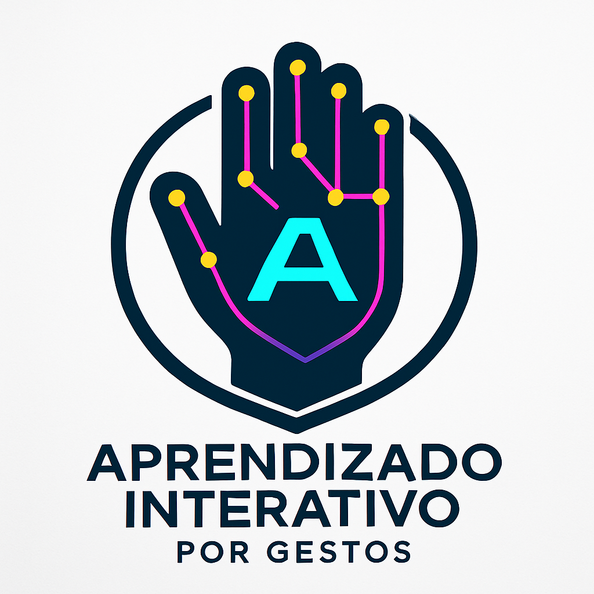
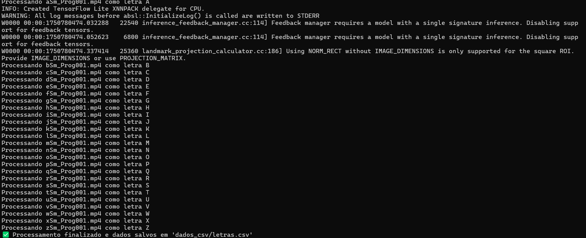
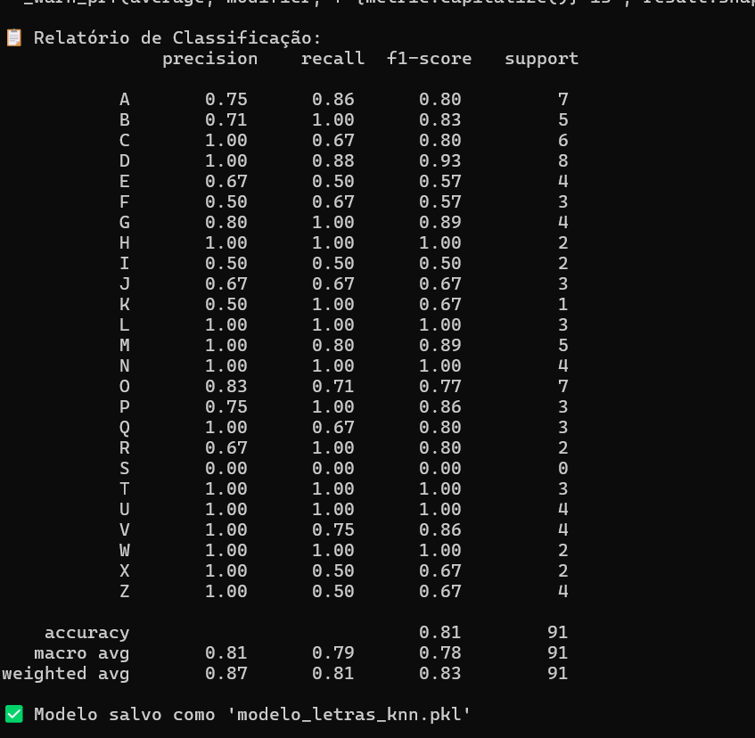
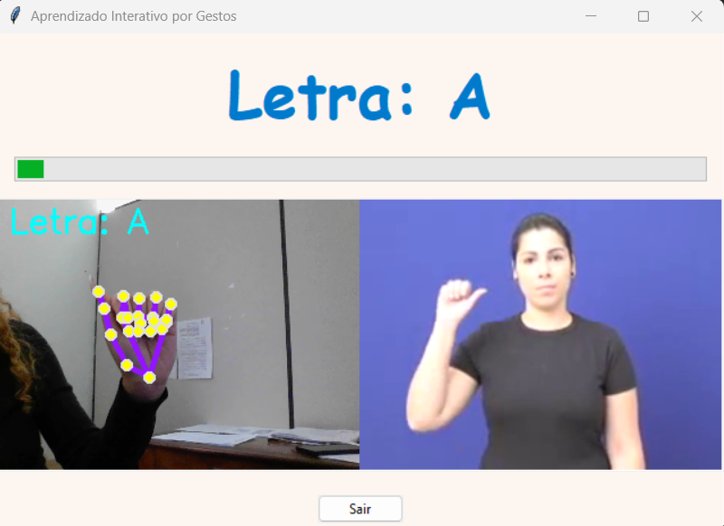

# 📁 README.md

<p align="center">
  
</p>

## 🖐️ Aprendizado Interativo por Gestos – Alfabeto em Libras

Este projeto tem como objetivo ensinar o alfabeto em Libras (Língua Brasileira de Sinais) de forma interativa utilizando reconhecimento de gestos com MediaPipe, OpenCV e um modelo de Machine Learning treinado com vídeos reais de cada letra.

---

## 📌 Funcionalidades
- 📷 Interface gráfica intuitiva com Tkinter
- 🧠 Reconhecimento de gestos da mão em tempo real
- 🔠 Exibição de uma letra do alfabeto e um vídeo de referência
- ✅ Feedback sonoro e visual ao reconhecer corretamente
- 🔊 Narração automática da letra
- ⏭️ Avanço automático para a próxima letra após o acerto
- 🔁 Treinamento do modelo com dados extraídos de vídeos personalizados

---

## 🗂️ Estrutura dos Arquivos

- `contarDedos.py` — Coleta os pontos das mãos a partir dos vídeos e salva em um `.csv`
- `treinarIA.py` — Treina o modelo KNN com os dados extraídos
- `reconhecerLetra.py` — Interface gráfica com reconhecimento em tempo real
- `modelo_letras_knn.pkl` — Arquivo gerado com o modelo treinado
- `videos/` — Pasta com os vídeos de cada letra (ex: `aSm_Prog001.mp4`, `bSm_Prog001.mp4`, ...)
- `dados_csv/letras.csv` — CSV com os pontos da mão e o rótulo da letra
- `acerto.mp3` — Som de feedback positivo

---

## 📦 Requisitos

- Python 3.8+
- OpenCV
- MediaPipe
- Scikit-learn
- Pandas
- Tkinter (incluído no Python)
- joblib
- pyttsx3
- playsound
- Pillow

Instale com:
```bash
pip install opencv-python mediapipe scikit-learn pandas pyttsx3 playsound pillow
```

---

## ▶️ Como Rodar

1. Adicione vídeos curtos dos gestos em `videos/`, com nomes como `aSm_Prog001.mp4`, `bSm_Prog001.mp4`, etc.
2. Execute `contarDedos.py` para gerar os dados:
```bash
python contarDedos.py
```
3. Treine o modelo:
```bash
python treinarIA.py
```
4. Rode o sistema interativo:
```bash
python reconhecerLetra.py
```

---

## 🧠 Como Funciona

1. A câmera captura a imagem da mão do usuário.
2. O MediaPipe localiza os 21 pontos da mão.
3. Esses pontos são passados para o modelo KNN treinado.
4. O sistema compara o gesto com os dados das letras.
5. Se acertar:
   - A interface mostra "Correto!"
   - Um som de acerto é tocado
   - A voz narra a próxima letra
   - O sistema avança automaticamente

---

## 🌍 Impacto na Área

Esta aplicação promove acessibilidade, inclusão e aprendizado personalizado da Língua Brasileira de Sinais. 
Ela pode ser usada em:

- Escolas de educação bilíngue e inclusiva
- Centros de reabilitação auditiva
- Ambientes educacionais interativos e museus
- Plataformas de ensino remoto

Com baixo custo e alta interatividade, permite que crianças, jovens e adultos aprendam LIBRAS de forma divertida e eficaz.

---

## 📸 Exemplo Visual

- WebCam + Vídeo lado a lado
- Pontos da mão desenhados com cores vibrantes

---

## Resultados
<p align="center">
  
</p>
<p align="center">
  
</p>
<p align="center">
  
</p>
<p align="center">
  
</p>

## ✨ Melhorias Futuras

- Adicionar reconhecimento de palavras completas
- Treinamento com mais vídeos e mais usuários
- Suporte a múltiplas mãos
- Implementação em versão mobile

---

## 👤 Autoria
Desenvolvido por Vitória Arruda Andrade, 2025.

---

✅ Status: Funcional e testado.

🧪 Acurácia Atual: Aproximadamente 81%

📁 Licença: Livre para fins educacionais
